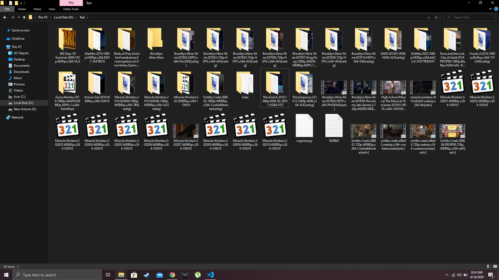
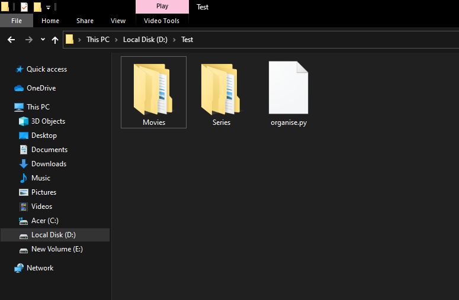
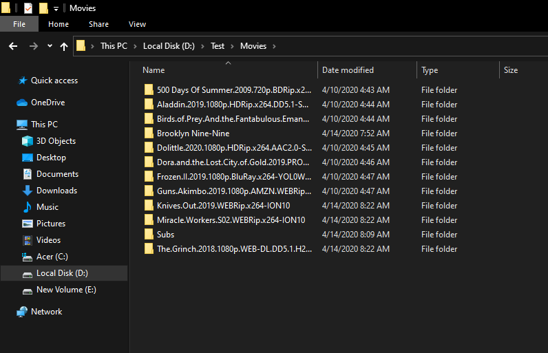
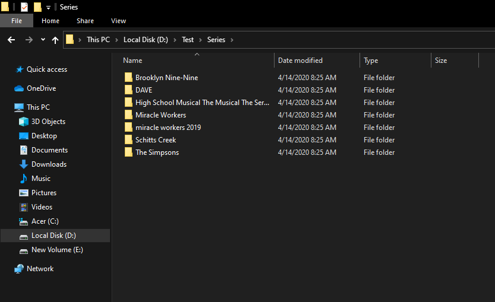

# Series and Movies Manager/Organiser

Python script to organise series and movies in serparate folders.

Just put the organise.py file in the folder to be organised or input the path of the folder.

## Installation

Only built-in libraries are used so no need to to install extra libraries.

To run the script:
```
python organise.py
```

## Example

### Folder to be organised



Just place the script in folder and run it.

## Output





